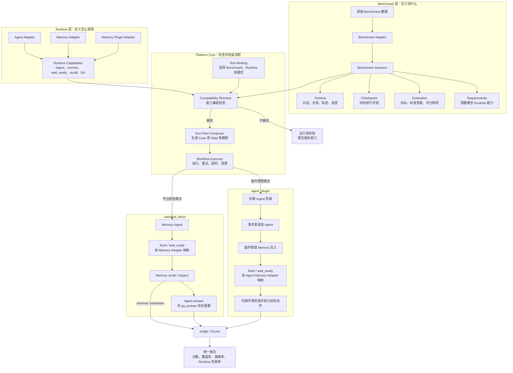
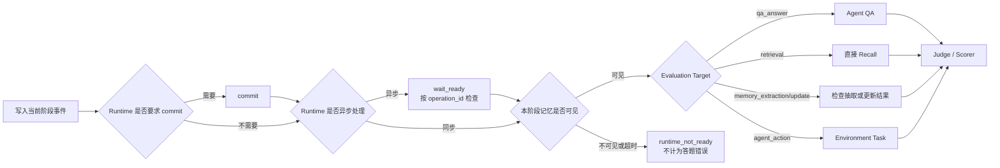

# Benchmark 与 Runtime Adapter 边界重构方案

## 1. 背景

MemoryWorkload 当前已经具备 Benchmark Skill、Agent Skill、Memory Skill、Memory Plugin、原生 Workflow、Judge 和统一报告等能力，能够运行 `backend_direct` 与 `agent_plugin` 两种记忆测试模式。

现有实现的主要问题不是流程无法运行，而是 Benchmark 与 Runtime 的职责边界不够清晰。以 LoCoMo 为例，Benchmark Builder 除了负责解析数据、划分 Session、构造问题和标准答案，还直接生成 Memory 写入、Agent ingest、插件阶段切换、flush、任务轮询和 QA 等运行步骤。

这种实现适合快速跑通第一个 Benchmark，但新增 Benchmark 时容易重复复制 LoCoMo 的运行逻辑。接入者不仅要理解新数据集，还要理解 Agent、Memory 和插件生命周期，实际接入效率较依赖熟悉平台的开发者或 MetaAgent 辅助生成代码。

本方案通过明确 Benchmark Adapter、Runtime Adapter 和 Platform Core 的职责，降低新 Benchmark 与新 Runtime 的接入成本。MetaAgent 可以参与实现 Adapter，但不是平台正确运行的必要条件。

## 2. 改造目标

1. Benchmark Adapter 只负责定义“测什么”，不包含具体 Agent 或 Memory 生命周期。
2. Runtime Adapter 只负责定义“外部系统怎么调用”和“具备什么能力”。
3. Platform Core 负责能力匹配、生成 Run Plan 和调度完整生命周期。
4. 同一个 Benchmark Adapter 可以不修改代码地切换 `backend_direct` 与 `agent_plugin`。
5. 新增 Benchmark 原则上只新增自己的 Skill，不修改 Runtime Adapter 和平台核心代码。
6. 新增 Agent、Memory 或 Memory Plugin 原则上不修改已有 Benchmark。
7. 保留现有 Workflow、Operator、Runner、Storage 和 Reporter，避免推倒重写。
8. 新旧协议可以并行运行，支持逐步迁移和结果对比。

## 3. 非目标

1. 本次不要求 MetaAgent 自动分析仓库并自动生成完整 Adapter。
2. 本次不负责统一启动和销毁所有外部 Agent、Memory 服务。
3. 本次不要求一次性迁移所有 Benchmark 和 external runner。
4. 本次不使用同一种业务指标评价所有 Benchmark。
5. 本次不删除现有 `native_workflow`，在迁移完成前继续兼容旧 Builder。

## 4. 当前边界问题

当前流程近似为：

```text
原始 Benchmark
  → Benchmark Builder
      → 数据解析
      → Case 构造
      → backend_direct 生命周期
      → agent_plugin 生命周期
      → 具体 Agent/Memory 参数
  → Case + Step
  → Workflow 执行
```

主要问题包括：

- Benchmark Builder 同时承担测试语义和运行编排。
- 不同 Benchmark 会重复生成 `prepare/set_phase/flush/wait_settle/finalize`。
- Benchmark 可能出现 OpenClaw、OpenViking、Session ID 等具体系统信息。
- 切换记忆集成模式需要在 Benchmark Builder 中增加分支。
- 平台缺少统一的 Benchmark 中间协议，无法独立检查数据映射是否正确。
- 当前兼容检查主要覆盖 stateful Agent 和 ingest unit，无法完整验证 Runtime 能力。
- Benchmark Judge 与独立 Scorer 的职责可能重叠，存在两套正式分数的风险。
- 流程跑通后，仍难区分问题来自数据组装、运行编排、Memory、Agent 还是 Judge。

## 5. 目标架构

```text
原始 Benchmark
  → Benchmark Adapter
  → Benchmark Scenario
        ├── Samples / Timeline / Checkpoints / References
        ├── Runtime Requirements
        └── Evaluation Spec

Agent / Memory / Memory Plugin
  → Runtime Adapter
  → Runtime Capabilities + Atomic Operations + Lifecycle

Benchmark Scenario + Run Binding + Runtime Capabilities
  → Compatibility Resolver
  → Run Plan Composer
  → Case + Executable Step
  → 现有 Workflow Executor
  → Judge / Scorer
  → 统一报告
```

整体结构如下：



核心原则为：

```text
Benchmark Adapter 定义测什么
Runtime Adapter 定义怎么调用
Platform Core 决定怎么组合和运行
Benchmark Evaluation 定义怎么评分
```

## 6. 职责划分

### 6.1 Benchmark Adapter

Benchmark Adapter 负责：

- 加载和校验原始数据。
- 识别 Sample、Session、Turn 和 Question。
- 保留 Session 顺序、时间戳和样本关系。
- 构造 Case、问题、标准答案和题型。
- 声明 Runtime Requirements。
- 声明 Evaluation Target、Profile 和主要指标。
- 将平台预测映射到 Benchmark 的评分输入。

Benchmark Adapter 不负责：

- 调用具体 Agent 或 Memory。
- 决定使用 `backend_direct` 还是 `agent_plugin`。
- 设置 `autoCapture`、`autoRecall` 等插件配置。
- 生成 `flush`、`wait_settle`、`set_phase` 和 `finalize`。
- 计算具体 Agent Session ID。
- 包含 OpenClaw、OpenViking 等 Runtime 特有逻辑。

### 6.2 Runtime Adapter

Runtime Adapter 负责：

- 声明 Agent、Memory 和插件的实际能力。
- 实现平台协议到外部 CLI/API 的映射。
- 执行 Agent `run_task`。
- 执行 Memory `ingest/status/recall`。
- 执行 Memory Plugin 的生命周期原子操作。
- 实现健康检查、错误转换和诊断信息。

Runtime Adapter 不负责：

- 解析具体 Benchmark 数据。
- 决定问题和标准答案。
- 决定 Benchmark 的正式评分规则。
- 针对具体 Benchmark ID 编写分支。

### 6.3 Platform Core

Platform Core 负责：

- 加载 Benchmark Scenario 和 Runtime Capabilities。
- 解析 Run Binding。
- 在运行前完成能力兼容检查。
- 根据集成模式生成具体 Case/Step 依赖图。
- 调度超时、重试、轮询、失败控制和 finalize。
- 统一保存输入、计划、过程、指标和报告。

## 7. Benchmark Scenario 协议

新增 `source_kind=benchmark_scenario`，作为 Benchmark Adapter 的标准输出。Scenario 既要支持“全部写入后统一评测”，也要支持“按时间线写入并在指定位置评测”。

建议结构：

```json
{
  "source_kind": "benchmark_scenario",
  "benchmark_id": "locomo",
  "requirements": {
    "agent": {
      "multi_turn": true,
      "stateful_session": true
    },
    "memory": {
      "actions": ["ingest", "recall"],
      "consistency": "checkpoint_visible"
    }
  },
  "evaluation": {
    "target": "qa_answer",
    "profile": "llm_judge@1",
    "primary_metric": "accuracy"
  },
  "samples": [
    {
      "sample_id": "sample-0",
      "namespace_hint": "sample-0",
      "timeline": [
        {
          "event_id": "session-1",
          "type": "conversation",
          "timestamp": "2024-01-01T00:00:00Z",
          "payload": {
            "messages": [
              {"role": "user", "content": "..."},
              {"role": "assistant", "content": "..."}
            ]
          }
        },
        {
          "event_id": "check-1",
          "type": "checkpoint",
          "evaluation": {
            "target": "qa_answer",
            "questions": [
              {
                "question_id": "q1",
                "question": "...",
                "reference": "...",
                "category": "single-hop"
              }
            ]
          }
        }
      ],
      "metadata": {}
    }
  ]
}
```

`timeline` 中第一阶段至少支持：

- `conversation`：多轮对话或 Session。
- `document`：文档、剧本或其他可写入内容。
- `trajectory`：Agent/环境历史轨迹。
- `feedback`：用户反馈或任务结果。
- `checkpoint`：在当前位置触发一次评测。

简单 QA Benchmark 可以使用“所有输入事件 + 末尾一个 checkpoint”的简写，由 Adapter SDK 展开为统一时间线。需要比较不同阶段记忆状态的 Benchmark，可以声明多个 checkpoint。

### 7.1 时间推理与阶段性评测

时间推理不等于边写边测。两者应分开表达：

- **时间推理**：问题要求理解事件顺序、时间间隔或历史时点；可以把全部带时间戳的历史写完后再测试，例如 LongMemEval。
- **阶段性评测**：需要在同一次连续运行中观察不同历史长度、偏好版本或反馈轮次下的状态；此时应在时间线中放置多个 checkpoint。PersonaMem、ConvoMem 或 MemoryBench 是否采用这种执行方式，应以其官方样本和评测协议为准；如果官方把不同观察时点拆成独立样本，则可以分别使用单个末尾 checkpoint。

是否设置中间 checkpoint 由 Benchmark 官方评测语义决定，不能仅因为数据包含时间戳就自动拆分。

### 7.2 Checkpoint 一致性屏障

边写边测不表示写入请求返回后立即查询。Composer 在每个 checkpoint 前插入 Runtime 所需的一致性屏障：

```text
写入本阶段事件
  → commit（Runtime 要求时）
  → wait_ready（异步 Runtime 要求时）
  → 校验 checkpoint token / operation ID 可见
  → 执行 Recall、QA、Memory Inspection 或 Environment Task
```



Memory/Plugin Runtime 应尽量返回 `operation_id`、`checkpoint_token` 或等价的可追踪凭证。`wait_ready` 应针对本阶段凭证确认完成，不使用无法归属到具体写入批次的固定 sleep。

如果到达超时仍未确认可查询，当前 checkpoint 标记为 `runtime_not_ready`，不把错误答案计入 Benchmark 准确率；报告单独统计准备失败率和等待耗时。

第一阶段至少支持以下 Evaluation Target：

- `qa_answer`：评价 Agent 最终答案。
- `retrieval`：直接评价 Memory 召回结果。
- `memory_extraction`：评价记忆抽取内容。
- `memory_update`：评价记忆更新与冲突处理。
- `agent_action`：评价 Agent 行动或任务完成结果。

## 8. Runtime Capabilities 协议

Agent Manifest 建议增加：

```yaml
integration:
  protocol_version: agent/1

capabilities:
  structured_input: true
  multi_turn: true
  stateful_session: true
  tool_calling: true
```

Memory Manifest 建议增加：

```yaml
integration:
  protocol_version: memory/1

capabilities:
  actions: [ingest, recall, inspect_memory]
  async_ingest: true
  commit:
    supported: true
    required_after_ingest: true
  readiness:
    supported: true
    scoped_by_operation: true
  evidence_output: true
```

Memory Plugin Manifest 建议增加：

```yaml
integration:
  protocol_version: memory-plugin/1

capabilities:
  auto_capture: true
  auto_recall: true
  commit:
    supported: true
    required_after_ingest: true
  readiness:
    supported: true
    scoped_by_operation: true
  qa_read_only: true

lifecycle:
  phases: [ingest, qa]
  actions: [validate, prepare, set_phase, commit, wait_ready, finalize]
```

`commit` 和 `wait_ready` 是通用语义，不要求所有 Runtime 都真正执行：

- OpenViking 插件可以将 `commit` 映射到 compact/commit，将 `wait_ready` 映射到按 task ID 轮询。
- 同步 Memory 可以声明 `required_after_ingest=false`、`async_ingest=false`，Composer 直接省略这两个步骤。
- 旧 Runner 内部仍可暂时接受 `flush`、`wait_settle`，由 Runtime Adapter 做协议映射；Benchmark Scenario 不出现这些实现名称。

第一阶段继续复用现有 Runner：

- Agent：`scripts/run_task.py`
- Memory：`scripts/run_operation.py`
- Memory Plugin：`scripts/run_lifecycle.py`

## 9. Run Binding

新增 Run Binding 表达本次测试选择，不把选择逻辑放入 Benchmark Adapter。

```yaml
benchmark:
  id: locomo
  dataset: small

runtime:
  agent: openclaw
  memory: openviking
  memory_integration: agent_plugin

evaluation:
  profile: llm_judge@1

isolation:
  namespace: run-id
```

现有 CLI 参数可以继续使用，由 CLI 转换成内部 `RunBinding`，暂时不要求用户必须提供 YAML 文件。

## 10. Compatibility Resolver

新增 `compatibility.py`，在生成 Run Plan 前执行：

```text
Benchmark Requirements ⊆ Runtime Capabilities
```

至少检查：

- Benchmark 是否要求多轮或 stateful Agent。
- Agent 是否支持结构化输入和多 Session。
- Memory 是否支持所需 action。
- 每个 checkpoint 所需的评测动作是否可用。
- Runtime 是否支持所需的 commit/readiness 语义和可追踪凭证。
- `agent_plugin` 是否存在匹配的 Agent + Memory Plugin。
- Memory Plugin 是否支持 Benchmark 所需生命周期。
- Evaluation Target 是否能从 Runtime 输出中取得所需字段。

失败时返回结构化结果：

```json
{
  "status": "incompatible",
  "missing_capabilities": ["memory.readiness.scoped_by_operation"],
  "suggestions": ["选择能按本次写入凭证确认可见性的 Memory Adapter"]
}
```

## 11. Run Plan Composer

新增 `composer.py`，负责将 Benchmark Scenario 编译为现有 Workflow 使用的 `CaseRecord + StepRecord`。

Composer 按 `timeline` 顺序生成步骤依赖图，而不是为所有 Benchmark 生成一条固定流水线。输入事件先交给对应 Runtime；遇到 checkpoint 时，再根据 Runtime 能力插入可选一致性屏障并执行该 checkpoint 的 Evaluation Target。

### 11.1 backend_direct

```text
每个 Sample：
  runtime.prepare

按 timeline：
  conversation/document/trajectory/feedback → memory.ingest
  checkpoint：
    memory.flush（由 Memory Adapter 映射为 Commit、Finalize 或同步空操作）
    memory.wait_ready（异步时，按本阶段凭证）
    memory.recall → agent.answer（qa_answer）
    或 memory.recall → retrieval score（retrieval）
    或 memory.inspect → extraction/update score

结束：
  runtime.finalize
```

### 11.2 agent_plugin

```text
每个 Sample：
  plugin.validate
  plugin.prepare
  plugin.set_phase(ingest)

按 timeline：
  conversation/document/trajectory/feedback → agent.ingest
  checkpoint：
    plugin.commit（由 Agent-Memory Adapter 映射为 Agent Compact、插件 Flush 或 Commit Hook）
    plugin.wait_ready（异步时，按本阶段凭证）
    plugin.set_phase(qa)（QA/Recall 要求时）
    agent.answer / memory.recall / memory.inspect / environment.run
    plugin.set_phase(ingest)（后续仍有输入事件时）

运行结束：
  plugin.finalize
```

Composer 只使用标准协议 action，不包含 `openclaw` 或 `openviking` ID 判断。

其中 `backend_direct` 的 `ingest` 只负责写入，不能隐式包含抽取和落盘；`flush` 才表达“让本阶段记忆达到可查询状态”。`agent_plugin` 的抽取触发必须留在 Agent-Memory Adapter 内，例如 OpenClaw + OpenViking 将 `plugin.commit` 映射为 OpenClaw 原生 `sessions.compact`，Runtime 不直接调用 OpenViking Commit API。

### 11.3 常见流程组合

```text
LoCoMo / LongMemEval：
  全部历史 → 一个末尾 checkpoint → Agent QA

PersonaMem / ConvoMem（官方协议要求连续观察时）：
  一批历史 → checkpoint → 新历史 → checkpoint

HaluMem extraction：
  历史 → checkpoint → inspect_memory → extraction scorer

LongMemEval-V2 retrieval：
  轨迹 → checkpoint → recall → evidence scorer

MemoryBench / MemoryArena：
  输入或环境任务 → 反馈/经验写入 → checkpoint → 后续任务
```

前两类可以由第一阶段 Composer 支持；`environment.run` 与反馈闭环应作为后续协议扩展，不阻塞 LoCoMo、PersonaMem 和 LongMemEval 的迁移。

### 11.4 Benchmark 覆盖范围

| Benchmark | 主要流程 | 本方案第一阶段覆盖 | 后续扩展 |
|---|---|---:|---|
| LoCoMo | 历史写入后 QA | 完整 | 无 |
| PersonaMem | 动态画像与个性化回答 | 基本完整 | 以官方协议确认是否需要连续多 checkpoint |
| LongMemEval | 带时间戳历史写入后 QA | 完整 | 无；时间推理本身不要求边写边测 |
| ConvoMem | 渐进历史下 QA | 基本完整 | 多 checkpoint 的数据规模与成本控制 |
| BEAM | 超长历史下 QA | 基本完整 | 流式输入、长度 checkpoint、成本与退化曲线 |
| ScriptMem | 叙事历史与选择/排序 QA | 基本完整 | 原始剧本授权数据、确定性选择题评分 |
| HaluMem | 抽取、更新、QA 分阶段诊断 | 部分 | `inspect_memory` 的标准输出和 extraction/update scorer |
| LongMemEval-V2 | 轨迹写入、证据召回与回答 | 部分 | trajectory/evidence 协议和 retrieval scorer |
| MemoryBench | 用户反馈驱动持续学习 | 部分 | 反馈—执行—再反馈闭环 |
| MemoryArena | Agent—Memory—Environment 多阶段任务 | 不完整 | Environment Adapter、动作/状态/奖励协议 |

该表表达协议覆盖度，不代表数据许可、官方脚本兼容性或具体 Runtime 已经完成适配。每个 Benchmark 接入时仍须以官方代码、数据格式和评分规则建立 Golden Test。

## 12. Evaluation 统一

Benchmark Manifest 建议使用统一 Evaluation Profile：

```yaml
evaluation:
  target: qa_answer
  profile: llm_judge@1
  primary_metric: accuracy
  metrics: [accuracy, pass_rate]
```

第一阶段支持：

- `exact_match@1`
- `classification@1`
- `llm_judge@1`
- `retrieval_ranking@1`
- `custom@1`

评分统一返回 Metric Envelope：

```json
{
  "primary_metric": "accuracy",
  "metrics": [
    {
      "name": "accuracy",
      "value": 0.8,
      "scope": "run",
      "unit": "ratio",
      "direction": "higher_is_better"
    }
  ],
  "artifacts": []
}
```

正式评分不得静默降级。例如 LLM Judge 配置缺失或调用失败时，应将评分标记为无效，不能自动切换为字符串包含判断。

## 13. 验证与 Golden Test

MetaAgent 是否参与实现不影响接入标准。所有 Adapter 必须经过相同验证。

Benchmark Skill 增加：

```text
tests/golden/
├── source_sample.json
├── expected_scenario.json
├── predictions.json
└── expected_metrics.json
```

至少验证：

```text
source_sample
  → Benchmark Adapter
  → expected_scenario
```

```text
predictions
  → Evaluation Profile / Scorer
  → expected_metrics
```

建议提供命令：

```bash
memory-bench integration validate <skill-path>
memory-bench integration test <skill-path>
memory-bench integration smoke <skill-path>
```

`integration create` 可以作为后续能力，不是本次边界重构的前置条件。

## 14. 运行记录与诊断

每次运行建议额外保存：

```text
records/benchmark_scenario.json
records/run_binding.json
records/runtime_capabilities.json
records/compatibility_result.json
records/composed_run_plan.json
records/evaluation_profile.json
records/checkpoint_readiness.json
```

发生低准确率或流程失败时，按以下顺序定位：

```text
Benchmark 数据映射
  → Compatibility
  → Composed Run Plan
  → Runtime 调用
  → Memory ingest/commit/readiness/recall
  → Agent 回答
  → Judge/Scorer
```

报告至少分开统计：

- `benchmark_score`：仅对实际完成评测的题目计算。
- `checkpoint_ready_rate`：进入评测前成功达到可查询状态的 checkpoint 比例。
- `runtime_failure_rate`：写入、commit、等待或调用失败比例。
- `readiness_latency`：从阶段写入结束到确认可查询的耗时。

不得用“未落盘导致未作答”的结果拉低或抬高 Benchmark 准确率；总报告同时展示覆盖题数，避免只报告成功子集造成误导。

## 15. 代码改动范围

### 15.1 新增核心模块

```text
memory_bench_platform/benchmark_scenario.py
memory_bench_platform/compatibility.py
memory_bench_platform/composer.py
memory_bench_platform/evaluation_profiles.py
```

### 15.2 修改核心模块

- `protocol.py`：增加 Benchmark Scenario、Requirements、Run Binding 等模型。
- `manifests.py`：增加 integration、capabilities、requirements、evaluation 字段。
- `integration.py`：加载新协议、能力解析和兼容检查。
- `cli.py`：构造 Run Binding，支持新旧 source kind。
- `judges.py`：接入统一 Evaluation Profile，取消静默评分降级。
- `reporter.py`：展示兼容检查、Evaluation Profile、checkpoint 覆盖率和 Benchmark/Runtime 分层结果。

### 15.3 第一批迁移 Skill

- `skills/benchmarks/locomo`
- `skills/benchmarks/longmemeval`
- `skills/agents/openclaw`
- `skills/memories/openviking`
- `skills/memory_plugins/openclaw-openviking`

### 15.4 基本保留

- `workflow.py`
- `workflow_operators.py`
- `executor.py`
- Agent `run_task.py`
- Memory `run_operation.py`
- Memory Plugin `run_lifecycle.py`
- Storage、Resource Monitor 和现有 HTML 报告框架

## 16. 兼容迁移方案

### 阶段一：增加新协议，不修改现有行为

平台同时支持：

```text
source_kind=native_workflow
source_kind=benchmark_scenario
```

旧 Benchmark 继续直接输出 Case/Step；新 Benchmark 可以使用 Scenario + Composer。

### 阶段二：迁移 LoCoMo

将 LoCoMo Builder 中的两套运行分支移到 Composer。

迁移完成后，LoCoMo Builder 中不应再出现：

```text
memory_integration
validate_memory_plugin
set_plugin_ingest_phase
flush
wait_settle
set_plugin_qa_phase
```

### 阶段三：使用 PersonaMem 验证

PersonaMem Adapter 只实现：

- 数据加载。
- Session 边界识别。
- 偏好发生变化的时间线，以及官方评测时点到独立 Sample 或 checkpoint 的映射。
- Question、Reference、Category 映射。
- Evaluation 声明。

如果不再复制 LoCoMo 插件生命周期，且能在同一个 Sample 内可靠执行多个带 readiness 屏障的 checkpoint，说明边界重构有效。

### 阶段四：迁移 LongMemEval 和 retrieval-only

验证：

- 不同 QA 评分规则可以通过 Evaluation Profile 表达。
- 直接 Recall 评分不需要调用 Agent。

### 阶段五：清理旧路径

在新旧结果对齐、回归测试通过后，再逐步删除 Builder 中的重复运行逻辑和不再需要的 Benchmark 专用核心分支。

## 17. 测试要求

至少增加以下测试：

1. Benchmark Scenario schema 与序列化测试。
2. Requirements/Capabilities 匹配测试。
3. backend_direct Composer Golden Test。
4. agent_plugin Composer Golden Test。
5. LoCoMo 新旧 Run Plan 行为对比测试。
6. Plugin finalize 在失败路径仍执行的测试。
7. Retrieval-only 不调用 Agent 的测试。
8. Evaluation Profile Metric Envelope 测试。
9. Judge 配置失败不静默降级测试。
10. 新 Benchmark 不包含 Runtime 特有 action 的静态检查。
11. 单 checkpoint 与多 checkpoint 时间线 Composer 测试。
12. 同步 Runtime 自动省略 commit/wait_ready 的测试。
13. 异步 Runtime 未 ready 时不进入评分、且结果标记为 `runtime_not_ready` 的测试。
14. 时间戳数据不会被错误地自动转换成中间 checkpoint 的测试。

## 18. 风险与控制

### 18.1 不同插件生命周期不完全相同

控制方式：定义 `memory-plugin/1` 的最小标准生命周期，非必需 action 通过 capabilities 声明为可选；协议无法表达的新能力应单独扩展版本，不在 Benchmark 中加入特判。

### 18.2 新旧 Run Plan 结果可能不一致

控制方式：保留双路径，使用同一数据、Runtime 和 Judge 比较 Case 数、Session 顺序、Question、Reference 和最终结果。

### 18.3 Benchmark Scenario 过度抽象

控制方式：第一阶段只覆盖 LoCoMo、PersonaMem 和 LongMemEval 已验证的公共字段；特殊 Benchmark 使用 `metadata` 和 `custom@1`，避免过早设计过大的统一模型。

### 18.4 核心 Composer 再次出现具体系统分支

控制方式：Composer 只能根据 protocol、capabilities 和 integration mode 分支，测试中禁止根据 Benchmark、Agent 或 Memory ID 分支。

### 18.5 固定等待导致未落盘数据进入评测

控制方式：异步 Runtime 必须通过本阶段 `operation_id` 或 `checkpoint_token` 确认可见性；超时标记为 `runtime_not_ready` 并与答案错误分开统计。固定 sleep 只能作为缺少状态接口时显式声明的降级能力，不能作为默认实现。

### 18.6 对 checkpoint 的过度使用

控制方式：仅当 Benchmark 官方语义要求比较不同阶段状态时设置中间 checkpoint。普通时间推理只保留时间戳和一个末尾 checkpoint，避免额外 commit 改变被测系统行为或扩大测试成本。

## 19. 完成标准

满足以下条件后，认为本次边界重构完成：

```text
新增 Benchmark：Platform Core Changes = 0
新增 Benchmark：Runtime Adapter Changes = 0
新增 Runtime：Existing Benchmark Changes = 0
切换 backend_direct / agent_plugin：Benchmark Scenario 不变
Benchmark Builder 不包含 Runtime 生命周期 action
Compatibility 在运行前发现能力缺失
多 checkpoint 在确认本阶段记忆 ready 后才进入评测
Runtime 未 ready 不计为 Benchmark 答题错误
Golden Test 能验证数据和评分映射
正式评分只有一个主要指标来源
```

最终目标不是要求 MetaAgent 自动完成接入，而是让开发者和 MetaAgent 都能基于同一模板、协议和验证流程可靠地完成接入。
